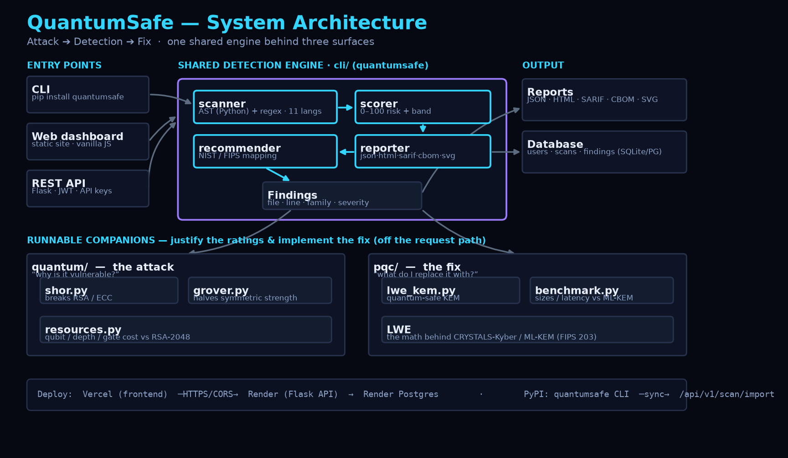
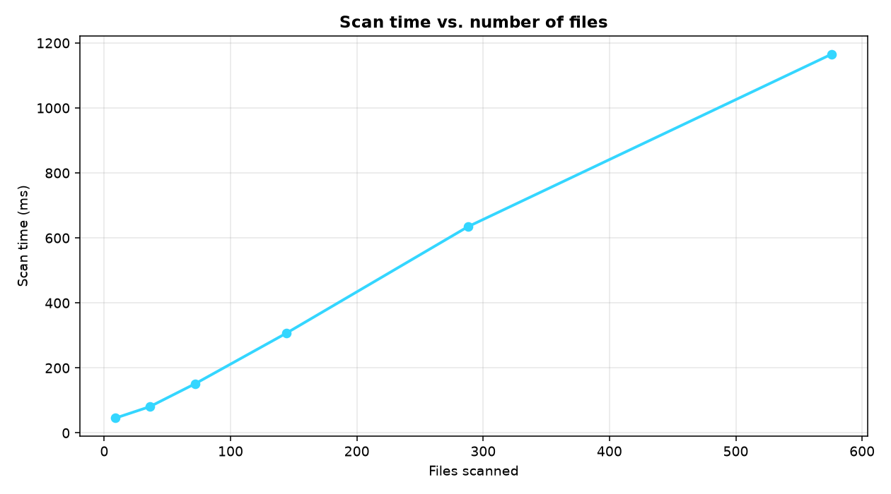
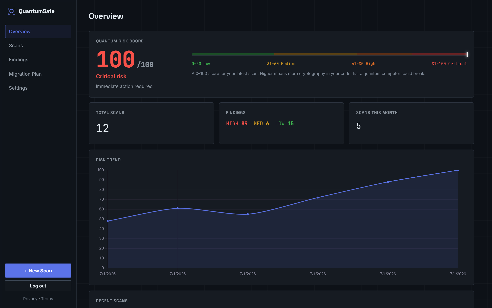
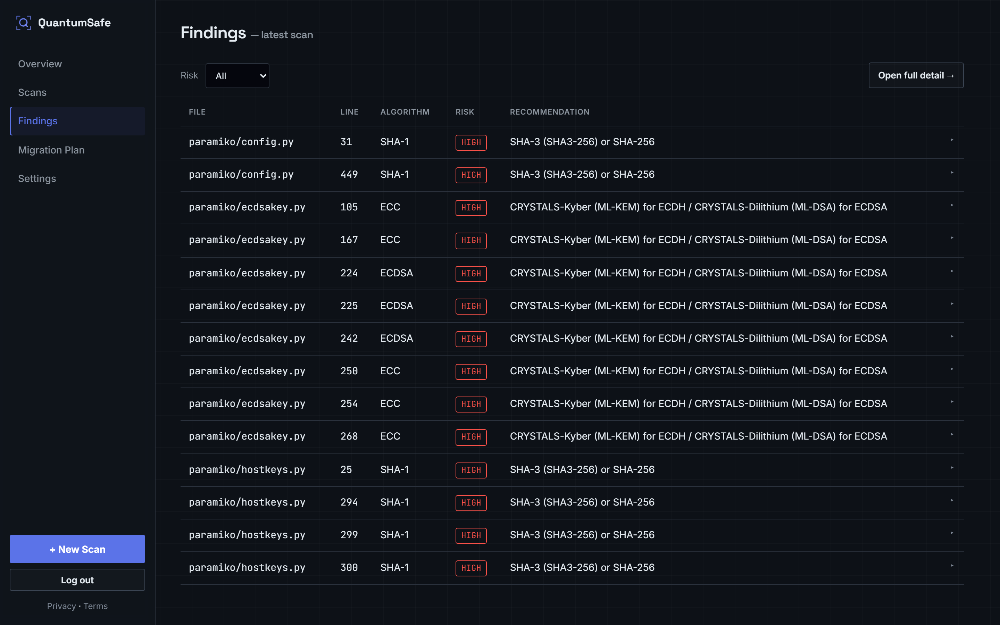
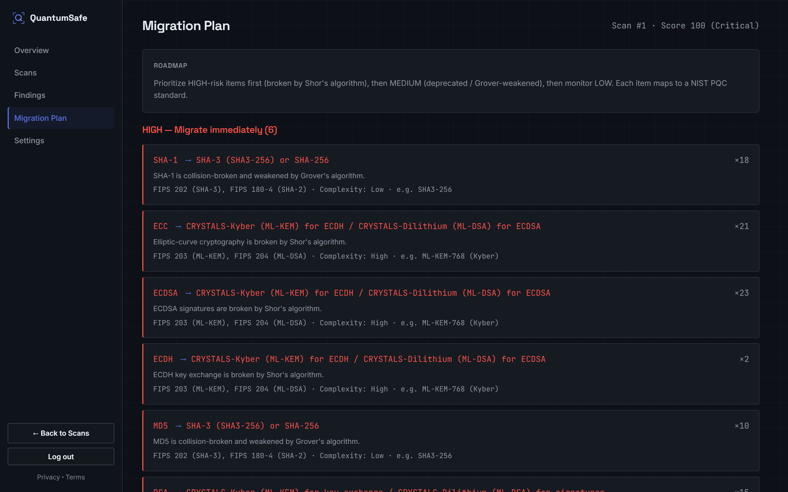

# QuantumSafe

[](https://github.com/Danny-397/Quantamn-Safe/actions/workflows/ci.yml)


**A post-quantum security platform that demonstrates the quantum attack, detects
the vulnerable cryptography in your code, and implements the quantum-safe fix.**

QuantumSafe scans code across 11 languages for the cryptography that quantum
computers will break (RSA, ECC, Diffie-Hellman) or weaken (AES-128, SHA-256),
scores the risk 0–100, and maps every finding to its NIST FIPS 203/204/205
replacement — backed by a real Qiskit implementation of Shor's and Grover's
algorithms and a from-scratch lattice (LWE) key-encapsulation mechanism.

> ⚠️ **Disclaimer.** QuantumSafe is a security-awareness and triage tool. It uses
> static pattern + AST analysis and is **not** a substitute for a professional
> cryptographic audit. Findings are heuristic and may include false
> positives/negatives.

---

## The three layers

QuantumSafe covers the full arc of the post-quantum problem — not just naming it,
but **executing** the attack, **finding** the vulnerable code, and **running** the
solution:

| Layer | Module | What it does |
|-------|--------|--------------|
| **1. Attack** | [`quantum/`](quantum/) | Shor's and Grover's algorithms in **Qiskit**, run on a quantum simulator. Shor factors a number and reconstructs an RSA key — the concrete reason RSA/ECC are rated HIGH. |
| **2. Detection** | [`cli/`](cli/) | A hybrid **AST + regex** static-analysis engine over 11 languages that scores risk and produces a NIST-aligned migration plan. **100% precision/recall** on a labeled [benchmark](benchmark/). |
| **3. Fix** | [`pqc/`](pqc/) | A from-scratch **lattice (LWE) key-encapsulation mechanism** — the math behind CRYSTALS-Kyber / ML-KEM — so the recommended fix is runnable and provable. |

The detection layer ships through three surfaces that share **one** engine:

- A **free CLI** (`pip install quantumsafe`) — scan local dirs or public GitHub
  repos; export JSON / HTML / SARIF / CBOM / SVG badge.
- A **Flask REST API** — powers the dashboard, ingests scans, handles auth.
- A **dark, terminal-style web dashboard** — scan history, findings, migration
  plans, and exports. **Free, no paywall.**

---

## Why it matters

RSA-2048 and elliptic-curve crypto secure almost everything — HTTPS/TLS,
certificates, SSH, code signing, VPNs. **Shor's algorithm breaks all of it.** The
math is settled; only the hardware is missing (RSA-2048 needs millions of
error-corrected qubits, and today's machines have a few hundred noisy ones).

That gap is the reason to act now, not later:

- **"Harvest now, decrypt later":** an adversary can record encrypted traffic
  today and decrypt it once the hardware exists. Anything that must stay secret
  for 5–15 years is effectively at risk *now*.
- **Migration is slow:** swapping cryptography across a large codebase takes years
  — which is why NIST finalized the post-quantum standards (FIPS 203/204/205) in
  2024.

QuantumSafe makes that migration tractable: **find** the vulnerable crypto,
**understand** why it's vulnerable, and **adopt** the quantum-safe replacement.

---

## Architecture



One shared detection engine (`cli/`) sits behind three surfaces — the CLI, the
REST API, and the web dashboard — and is flanked by two runnable companions: the
`quantum/` attack module (which *justifies* the risk ratings) and the `pqc/`
defense module (which *implements* the recommended fix). Full write-up in
[docs/ARCHITECTURE.md](docs/ARCHITECTURE.md); the diagram is regenerated by
`python docs/make_architecture.py` (vector source: [docs/architecture.svg](docs/architecture.svg)).

## Documentation

| Document | What's in it |
|----------|--------------|
| [docs/WHITEPAPER.md](docs/WHITEPAPER.md) | Full technical whitepaper: threat model, design, scoring, evaluation, limitations, future work |
| [docs/ARCHITECTURE.md](docs/ARCHITECTURE.md) | Components, the CLI→API→Scanner→Risk→Export pipeline, data flow, deployment topology |
| [docs/architecture_diagram.txt](docs/architecture_diagram.txt) | One-screen ASCII system diagram |
| [docs/EXAMPLES.md](docs/EXAMPLES.md) | **Real** scan output — terminal table, JSON, SARIF, HTML, badge |
| [docs/NIST_MAPPING.md](docs/NIST_MAPPING.md) | Every detected family → its NIST PQC replacement, with the reasoning |
| [docs/CVE_MAPPING.md](docs/CVE_MAPPING.md) | Findings mapped to general vulnerability classes (no invented CVEs) |
| [benchmark/RESULTS.md](benchmark/RESULTS.md) | Precision/recall/F1, risk distribution, reproducible charts |
| [TECHNICAL_OVERVIEW.md](TECHNICAL_OVERVIEW.md) | Design decisions, quantum-threat background, honest limitations |

---

## Key features

- **11-language detection** — Python (AST-aware), JavaScript/TypeScript, Java, Go,
  Ruby, C#, PHP, Rust, C/C++, Kotlin, Swift.
- **0–100 Quantum Risk Score** computed from real findings (never hardcoded), with
  Low/Medium/High/Critical bands.
- **NIST-aligned migration plan** — each finding mapped to ML-KEM/ML-DSA/SHA-3/
  AES-256 with the relevant FIPS standard and a complexity estimate.
- **Six export formats** — terminal, JSON, HTML, **SARIF** (GitHub code scanning),
  **CycloneDX CBOM**, and an embeddable **SVG risk badge**.
- **Real quantum demos** — Shor + Grover in Qiskit, plus circuit resource
  estimates.
- **Real post-quantum crypto** — an LWE KEM verified over 200+ key exchanges with
  zero failures.
- **Measured, not asserted** — a labeled benchmark with adversarial decoys, plus an
  empirical study (88% of real repos affected).
- **Production practice** — one shared engine for CLI + API, **65 automated
  tests**, CI, Docker, a reusable GitHub Action, and multi-service deploy configs.

---

## What it detects

| Risk | Algorithms |
|------|------------|
| **HIGH** — migrate immediately | RSA (any size, incl. RSA-2048/4096), ECDSA / ECDH / ECC, DSA, Diffie-Hellman, MD5, SHA-1 |
| **MEDIUM** — plan migration | TLS 1.0 / 1.1, 3DES / Triple DES, RC4, RSA key sizes under 2048 |
| **LOW** — monitor | SHA-256, AES-128, TLS 1.2 |

Each finding includes the file, line number, algorithm, risk level, *why* it is
vulnerable, and a NIST-approved replacement:

- RSA/ECC key exchange → **CRYSTALS-Kyber (ML-KEM, FIPS 203)**
- RSA/ECDSA/DSA signatures → **CRYSTALS-Dilithium (ML-DSA, FIPS 204)** / SPHINCS+ (FIPS 205)
- Hash functions → **SHA-3** or SHA-256
- Symmetric encryption → **AES-256**

## Quantum Risk Score

A 0–100 score computed **from real findings**:

```
score = min(100, 15*HIGH + 5*MEDIUM + 1*LOW)
```

| Score | Band | Meaning |
|-------|------|---------|
| 0–30 | Low | Good quantum hygiene |
| 31–60 | Medium | Plan migration |
| 61–80 | High | Prioritize migration |
| 81–100 | Critical | Immediate action required |

---

## Evaluation (does the detector actually work?)

The scanner is measured against a labeled [benchmark](benchmark/) of 15 files
across 9 languages, including adversarial decoys (crypto names in comments,
docstrings, log strings, and word-boundary traps like `md5sumLabel`) designed to
trip a naive matcher. `evaluate.py` runs the scanner twice — a naive line-regex
baseline vs. the string/comment-aware engine — so the improvement is measured:

```bash
python benchmark/evaluate.py
```

| Configuration | FP | Precision | Recall | F1 |
|---|--:|--:|--:|--:|
| Naive line-regex baseline | 14 | 65.0% | 100% | 78.8% |
| **QuantumSafe (usage-aware)** | **0** | **100%** | **100%** | **100%** |

Usage-awareness removes 14 false positives (keywords inside docstrings/log strings)
without losing a true positive. `evaluate.py` prints the exact false
positives/negatives so the numbers are auditable, and the thresholds are enforced
by `tests/test_benchmark.py`. Honest
limits are documented in [benchmark/README.md](benchmark/README.md) and
[benchmark/RESULTS.md](benchmark/RESULTS.md) — this is a regression benchmark, not
a claim of perfection on arbitrary code.

These charts are generated from **live scanner output** by
`python benchmark/graphs/generate_graphs.py` (not hardcoded):

| Vulnerabilities by family | Severity split | Scan time vs. files |
|---|---|---|
|  |  |  |

**See real scan output** — terminal table, JSON, SARIF, HTML, and an SVG risk
badge from an actual scan — in [docs/EXAMPLES.md](docs/EXAMPLES.md).

### Empirical study — how widespread is the problem?

Scanning 8 widely-used open-source projects ([`study/`](study/), reproducible via
`python study/run_study.py`):

- **88%** contained at least one **HIGH-risk** (Shor-breakable) cryptographic usage.
- Average Quantum Risk Score: **72.9 / 100**.

Full results and caveats: [study/REPORT.md](study/REPORT.md).

---

## Quantum demonstrations (Shor & Grover)

```bash
pip install -r quantum/requirements.txt
python quantum/shor.py        # quantum order-finding factors N=15, then breaks a toy RSA key
python quantum/grover.py      # recovers a hidden k-bit key in ~sqrt(2^k) steps
python quantum/resources.py   # qubit count, circuit depth, gate counts vs. RSA-2048 estimates
```

- **`shor.py`** uses quantum phase estimation over modular exponentiation to find
  the order of `a mod N`, factors `N`, and reconstructs an RSA private key — the
  concrete reason RSA/ECC are rated **HIGH**.
- **`grover.py`** uses amplitude amplification to search a key space in ~√N
  queries, halving effective key strength — the reason AES-128/SHA-256 are **LOW**.

Honest scope: these run at small scale (factoring 15), the genuine state of the art
for end-to-end Shor. See [quantum/README.md](quantum/README.md).

## Post-quantum solution ([`pqc/`](pqc/))

```bash
pip install -r pqc/requirements.txt
python pqc/lwe_kem.py     # Alice & Bob agree on a shared secret; an eavesdropper can't
python pqc/benchmark.py   # measured latency + key/ciphertext sizes vs RSA & ML-KEM
```

Why a quantum computer can't break it: LWE has **no periodic structure** for Shor
to exploit. See [pqc/README.md](pqc/README.md).

---

## CLI: install & usage

```bash
pip install quantumsafe        # from PyPI once published
# or, from this repo:
pip install -e .
```

### Commands

```bash
# Scan a local directory (colored terminal table)
quantumsafe scan --path ./myproject

# Scan a public GitHub repo (shallow-cloned to a temp dir, then cleaned up)
quantumsafe scan --repo https://github.com/org/app

# Write a report: JSON, HTML, SARIF, CycloneDX CBOM, or an SVG risk badge
quantumsafe scan --path ./myproject --output report.json
quantumsafe scan --path ./myproject --output report.html
quantumsafe scan --path ./myproject --output report.sarif       # GitHub code scanning
quantumsafe scan --path ./myproject --output report.cbom.json   # CycloneDX CBOM
quantumsafe scan --path ./myproject --output badge.svg          # embeddable risk badge

# Skip paths with glob patterns (repeatable)
quantumsafe scan --path . --exclude 'tests/*' --exclude 'vendor/*'

# Fail the process (exit 1) if any HIGH finding exists — handy in CI
quantumsafe scan --path . --fail-on-high

# Try it on the bundled examples
quantumsafe scan --path examples

# Link the CLI to your dashboard, then scans auto-upload to your history
quantumsafe auth --key qs_live_xxxxxxxx --api-url https://quantumsafe-api.onrender.com
quantumsafe scan --path ./myproject            # prints results AND syncs to dashboard
quantumsafe scan --path ./myproject --no-sync  # local only, don't upload

# Version
quantumsafe version
```

| Flag | Description |
|------|-------------|
| `--path` | Local directory or file to scan |
| `--repo` | Public `https://github.com/<org>/<repo>` URL |
| `--output` | Write to `.json`, `.cbom.json` (CycloneDX CBOM), `.html`, `.sarif`, or `.svg` (risk badge); terminal summary still printed |
| `--exclude` | Glob of paths to skip (repeatable) |
| `--fail-on-high` | Exit non-zero on any HIGH finding (CI gate) |
| `--no-sync` | Don't upload the result to your linked dashboard |

After `quantumsafe auth --key <key> --api-url <your-api>`, every `quantumsafe scan`
also uploads its report to your dashboard (`POST /api/v1/scan/import`). Use
`--no-sync` to keep a scan local.

**Suppressing a finding:** add `# quantumsafe: ignore` (any comment style) to the
line.

### Use in CI (GitHub Action)

```yaml
- uses: Danny-397/Quantamn-Safe@main
  with:
    path: .
    exclude: tests/*,vendor/*
    fail-on-high: "true"
- uses: github/codeql-action/upload-sarif@v3
  with:
    sarif_file: quantumsafe.sarif
```

---

## API documentation

Base URL (dev): `http://localhost:5000` · all endpoints under `/api/v1`.
Authentication: **JWT** (`Authorization: Bearer <token>`) for the dashboard, or a
**CLI API key** (`X-API-Key: qs_live_...`) for the scan endpoint.

### Auth

```http
POST /api/v1/auth/register      { "email", "password" }  -> { token, user }
POST /api/v1/auth/login         { "email", "password" }  -> { token, user }
GET  /api/v1/auth/verify?token=...                        -> { message }
POST /api/v1/auth/forgot        { "email" }               -> { message }
POST /api/v1/auth/reset         { "token", "password" }   -> { message }
GET  /api/v1/auth/me            (JWT)                      -> { user }
```

### Scanning

```http
POST /api/v1/scan               (JWT or X-API-Key)
     { "repo_url": "https://github.com/org/app" }   # or multipart file=<.zip>
     -> { scan_id, report }

POST /api/v1/scan/import        (X-API-Key)   # used by the CLI to upload results
     { "report": { ...quantumsafe report... } } -> { scan_id }

POST /api/v1/demo-scan          (public, rate-limited)  # landing-page live demo
     { "code": "..." } -> { report }   # runs the real engine, stores nothing

GET  /api/v1/scans?page=1&per_page=20   (JWT)  -> paginated list
GET  /api/v1/scans/{id}                 (JWT)  -> scan + findings
GET  /api/v1/scans/{id}/export?format=json|html|csv|sarif|cbom|svg   (JWT)
GET  /api/v1/scans/{id}/migration       (JWT)  -> grouped migration plan
GET  /api/v1/overview                   (JWT)  -> dashboard stats + trend
```

### API key management

```http
GET  /api/v1/user/apikey   (JWT)  -> { has_api_key, api_key_prefix }
POST /api/v1/user/apikey   (JWT)  -> { api_key }   # full key shown ONCE
```

All endpoints are rate-limited; CORS is restricted to `FRONTEND_ORIGIN`. GDPR-style
endpoints (`/user/data` export, `/user/account` delete) let a user export or erase
all of their data.

---

## Dashboard

| Overview | Findings | Migration plan |
|---|---|---|
|  |  |  |

A static site (`frontend/`) — no build step. Pages:

- **Landing** — hero, in-browser live scanner, feature pillars (free, no paywall).
- **Auth** — login, register, forgot/reset password.
- **Dashboard** — Overview (risk score, totals, trend chart, recent scans),
  Scans (paginated), Findings (filterable), Settings (API key + account).
- **Scan detail** — full findings table, filter by risk, export JSON/HTML/CSV/SARIF/CBOM/SVG.
- **Migration plan** — findings grouped by risk with NIST replacement, standard
  reference, and estimated complexity.
- **Research** — a public explainer of Shor/Grover/LWE/Kyber and the NIST standards.

Point the dashboard at your API by editing one line in `frontend/config.js`:

```js
window.QUANTUMSAFE_API = "https://quantumsafe-api.onrender.com";
```

(Leave it `""` for local development — it falls back to `http://localhost:5000`.)

---

## Local development setup

Requires Python 3.9+.

```bash
git clone https://github.com/Danny-397/Quantamn-Safe
cd Quantamn-Safe

# 1) Install the shared scanner package (CLI) in editable mode
pip install -e .

# 2) Install backend dependencies
pip install -r backend/requirements.txt

# 3) Configure environment
cp .env.example .env          # fill in SECRET_KEY / JWT_SECRET_KEY at minimum

# 4) Run the API (creates SQLite tables automatically)
cd backend
python app.py                 # http://localhost:5000  (health: /health)

# 5) Serve the dashboard (any static server)
cd ../frontend
python -m http.server 3000    # http://localhost:3000
```

### Run the whole stack with Docker

```bash
docker compose up --build
# Dashboard -> http://localhost:3000   API -> http://localhost:5000
```

### Tests

```bash
pip install -r requirements-dev.txt
pytest -q                     # 65 tests; in-memory DB, no setup
```

Seed a demo account so the dashboard is populated:

```bash
cd backend && python seed_demo.py     # demo@quantumsafe.dev / demodemo123
```

Without `MAIL_SERVER` configured, verification/reset emails are printed to the
server log instead of being sent — so you can develop without SMTP.

---

## Environment variables

See [`.env.example`](.env.example).

| Variable | Required | Where to get it |
|----------|----------|-----------------|
| `SECRET_KEY` | ✅ | Generate: `python -c "import secrets;print(secrets.token_hex(32))"` |
| `JWT_SECRET_KEY` | ✅ | Generate the same way (use a different value) |
| `DATABASE_URL` | prod | Render Postgres dashboard → *Connections* (SQLite used if unset) |
| `FRONTEND_ORIGIN` | ✅ | Your dashboard URL, e.g. `https://quantumsafe.vercel.app` |
| `DASHBOARD_URL` | ✅ | Same as above (used in emails) |
| `API_URL` | ✅ | The deployed API URL (used for email verify links) |
| `MAIL_SERVER` / `MAIL_PORT` / `MAIL_USE_TLS` | email | Your SMTP provider (e.g. `smtp.gmail.com` / 587 / true) |
| `MAIL_USERNAME` / `MAIL_PASSWORD` | email | SMTP credentials (Gmail: an App Password) |
| `MAIL_DEFAULT_SENDER` | email | The "from" address |
| `RATELIMIT_STORAGE_URI` | optional | `memory://` (dev) or a Redis URL (prod) |

---

## Deployment

[](https://render.com/deploy?repo=https://github.com/Danny-397/Quantamn-Safe)

See **[DEPLOYMENT.md](DEPLOYMENT.md)** for the full walkthrough. In short:

- **CLI → PyPI:** `python -m build && twine upload dist/*`
- **Backend → Render:** push the repo; Render reads [`render.yaml`](render.yaml)
  (web service + Postgres). Set the `sync: false` env vars in the dashboard.
- **Frontend → Vercel:** set Root Directory to `frontend/`; point
  `frontend/config.js` at your Render API URL.

---

## Project structure

```
Quantamn-Safe/
├── quantum/              # REAL quantum computing (Qiskit): the attacks themselves
│   ├── shor.py           #   Shor's algorithm — factors N, breaks RSA
│   ├── grover.py         #   Grover's algorithm — key-search speedup
│   ├── resources.py      #   qubit / depth / gate-count estimation
│   └── README.md
├── pqc/                  # Post-quantum SOLUTION: lattice (LWE) crypto from scratch
│   ├── lwe_kem.py        #   quantum-safe key encapsulation (the math behind Kyber)
│   ├── benchmark.py      #   latency & sizes vs RSA / ML-KEM
│   └── README.md
├── cli/                  # the `quantumsafe` package (CLI + shared engine)
│   ├── scanner.py        #   AST + regex detection
│   ├── scorer.py         #   risk score
│   ├── recommender.py    #   NIST recommendations
│   ├── reporter.py       #   terminal / JSON / HTML / SARIF / CBOM / SVG output
│   └── cli.py            #   argparse entry point
├── backend/              # Flask REST API
│   ├── app.py  config.py  extensions.py  models.py
│   ├── auth.py  api.py  scanner_service.py
│   └── requirements.txt
├── frontend/             # static dashboard (no build step)
│   ├── index.html  login.html  dashboard.html  scan.html  migration.html
│   ├── research.html  privacy.html  terms.html
│   └── style.css  app.js  config.js
├── benchmark/            # labeled precision/recall evaluation (+ graphs/)
├── study/               # empirical scan over real open-source repos
├── docs/                # whitepaper, architecture, NIST & vuln-class mappings
├── pyproject.toml        # packages cli/ as `quantumsafe`
└── render.yaml  .env.example  README.md
```

---

## NIST PQC references

- **FIPS 203** — Module-Lattice-Based Key-Encapsulation Mechanism (ML-KEM / Kyber)
- **FIPS 204** — Module-Lattice-Based Digital Signature Algorithm (ML-DSA / Dilithium)
- **FIPS 205** — Stateless Hash-Based Digital Signature Algorithm (SLH-DSA / SPHINCS+)
- **NIST SP 800-52 Rev. 2** — TLS guidance
- **NIST SP 800-131A Rev. 2** — transitioning cryptographic algorithms/key lengths
- **NIST IR 8547** — transition to post-quantum cryptography standards

Full reasoning per algorithm: [docs/NIST_MAPPING.md](docs/NIST_MAPPING.md).

---

## License

MIT — see [LICENSE](LICENSE).
