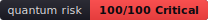

# Real scan examples

Everything on this page is **actual output** from running QuantumSafe against the
bundled [`examples/`](../examples/) project — not mocked. Reproduce it with:

```bash
pip install -e .
python -m quantumsafe.cli scan --path examples --no-sync
# (or, once installed on PATH:  quantumsafe scan --path examples)
```

The sample artifacts referenced below live in [`docs/examples/`](examples/) and
were generated the same way with `--output`.

---

## 1. Terminal output

```
┌───────────────────────────── QuantumSafe Scan ──────────────────────────────┐
│ Quantum Risk Score: 100/100  (Critical)                                     │
│ Immediate action required.                                                  │
│                                                                             │
│ Target: examples                                                            │
│ HIGH: 11   MEDIUM: 3   LOW: 2   Total: 16                                   │
└─────────────────────────────────────────────────────────────────────────────┘
┌────────────────────┬──────┬───────────────────┬────────┬────────────────────┐
│ File               │ Line │ Algorithm         │ Risk   │ Recommendation     │
├────────────────────┼──────┼───────────────────┼────────┼────────────────────┤
│ client.js          │    6 │ RSA               │ HIGH   │ CRYSTALS-Kyber     │
│ client.js          │    9 │ MD5               │ HIGH   │ SHA-3 / SHA-256    │
│ legacy/Crypto.java │    9 │ SHA-1             │ HIGH   │ SHA-3 / SHA-256    │
│ payments.py        │    5 │ RSA               │ HIGH   │ CRYSTALS-Kyber     │
│ payments.py        │    5 │ DSA               │ HIGH   │ CRYSTALS-Dilithium │
│ payments.py        │    9 │ RSA               │ HIGH   │ CRYSTALS-Kyber     │
│ payments.py        │   10 │ ECC               │ HIGH   │ CRYSTALS-Kyber     │
│ payments.py        │   11 │ DSA               │ HIGH   │ CRYSTALS-Dilithium │
│ payments.py        │   16 │ MD5               │ HIGH   │ SHA-3 / SHA-256    │
│ payments.py        │   20 │ SHA-1             │ HIGH   │ SHA-3 / SHA-256    │
│ safe.py            │    9 │ MD5               │ HIGH   │ SHA-3 / SHA-256    │
│ client.js          │   12 │ TLS 1.0           │ MEDIUM │ TLS 1.3            │
│ legacy/Crypto.java │    7 │ 3DES / Triple DES │ MEDIUM │ AES-256            │
│ legacy/Crypto.java │    8 │ RC4               │ MEDIUM │ AES-256 (GCM)      │
│ client.js          │   15 │ AES-128           │ LOW    │ AES-256            │
│ payments.py        │   24 │ SHA-256           │ LOW    │ SHA-256 (size up)  │
└────────────────────┴──────┴───────────────────┴────────┴────────────────────┘
```

(Recommendation column abbreviated here for width; the live table prints the full
NIST guidance and the score/recommendation are colorized.)

---

## 2. JSON report

`quantumsafe scan --path examples --output report.json` →
[`docs/examples/report.json`](examples/report.json):

```json
{
  "tool": "quantumsafe",
  "version": "0.1.0",
  "target": "examples",
  "risk_score": 100,
  "risk_band": "Critical",
  "risk_message": "Immediate action required.",
  "summary": { "total_findings": 16, "high": 11, "medium": 3, "low": 2 },
  "findings": [
    {
      "file_path": "client.js",
      "line_number": 6,
      "algorithm": "RSA",
      "risk_level": "HIGH",
      "why": "RSA public-key cryptography is broken by Shor's algorithm.",
      "family": "rsa",
      "recommendation": "CRYSTALS-Kyber (ML-KEM) for key exchange / CRYSTALS-Dilithium (ML-DSA) for signatures"
    }
  ]
}
```

---

## 3. SARIF 2.1.0 (GitHub code scanning)

`--output report.sarif` → [`docs/examples/report.sarif`](examples/report.sarif).
Upload it with `github/codeql-action/upload-sarif` and findings appear in the
repo's **Security** tab. One result:

```json
{
  "ruleId": "rsa",
  "level": "error",
  "message": {
    "text": "RSA: RSA public-key cryptography is broken by Shor's algorithm. Replace with CRYSTALS-Kyber (ML-KEM) ..."
  },
  "locations": [
    {
      "physicalLocation": {
        "artifactLocation": { "uri": "client.js" },
        "region": { "startLine": 6 }
      }
    }
  ]
}
```

The full file declares 10 rules and 16 results for this scan.

---

## 4. HTML report & SVG risk badge

- **HTML:** `--output report.html` → [`docs/examples/report.html`](examples/report.html)
  (a standalone, self-styled page — open it in a browser).
- **Risk badge:** `--output badge.svg` → [`docs/examples/badge.svg`](examples/badge.svg),
  embeddable in any README:



---

## 5. CI gate

Fail the build on any HIGH finding:

```bash
quantumsafe scan --path . --fail-on-high   # exit code 1 if any HIGH exists
```

See the reusable GitHub Action in the [README](../README.md#use-in-ci-github-action).
